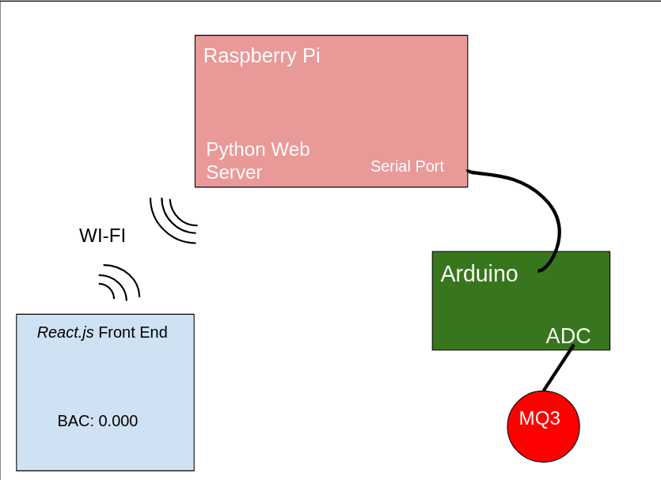

# BreathalyEZ
This project was initially made as part of HackUMass XI, a 36-hr hackathon hosted at UMass Amherst. 

The idea was to create a breathalyzer that could be connected to devices on a network, WI-FI in this case.
## The System Design
The base for the project was a MQ3 Alcohol Gas Sensor. The gas sensor has three pins, two for powering a heating element, and the remaining 4 being connected to a resistor that allows more current through when low-oxygen air passes over it. 

Connecting the sensor in series with a 5k Ohm resistor, we were able to create a voltage divider that would change voltage as the oxygen desisty of the air changed.

The sensor output was fed into an Arduino Uno, converting the analog signal to a digital output that was feed into the serial port interface.

A Raspberry Pi hosting a *Python* web server is connected to the Arduino's serial output. Allowing the output in millivolts to be converted to alcohol PPM with the following polynomial:
```
PPM = 150.4351049*v^5 - 2244.75988*v^4 + 13308.5139*v^3 -39136.08594*v^2 + 57082.6258*v - 32982.05333
```
Alcohol PPM could then be converted to BAC(Blood Alcohol Content) with the following:
```
BAC = PPM / 2600
```

BAC was then sent to the *React.js* front end, displaying the users BAC, and allowing the user to collect another sample.

System Diagram:


